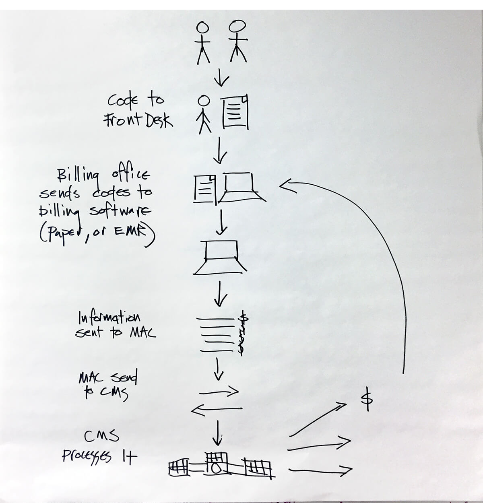

---
# Page template info (DO NOT EDIT)
layout: default
banner_file: banner--people-projects-lg.svg
banner_file_mobile: banner--people-projects-sm.svg
project_page: true

# Carousel (Edit this)
carousel_title: "Modernizing the Medicare Payment System"
carousel_summary: "Eight million lines of COBOL and 2.5 million lines of assembly running on 15 mainframes. 4.5 percent of the entire American economy is fueled by Medicare payments and 53 million people depend on it for their healthcare."
carousel_image_name: project-hhs-payment-mod-card.jpg

# Project detail page (Edit this)
title: "Medicare Payment System Modernization"
agency: Health and Human Services
permalink: projects/medicare-payment-program
project_url: 

# Impact statement (Edit this)
impact_statement:
  - figure: "53"
    unit: "M"
    description: |-
      Americans depend on Medicare payments for their healthcare

  - figure: 65
    unit: "K"
    description: |-
      New monthly claims priced in the cloud‑based service during the first few months of 2020

  - figure: ">75"
    unit: "%"
    description: |-
      Reduction in time needed to deploy new code in the cloud‑based system (from four weeks to a few days)
---

## The Challenge

The Medicare Payment System has singular importance in determining how health care is provided in the United States. Medicare pays for the health care of 53 million Americans, making it the largest health payer in the U.S. The systems that process claims payments were first built in 1966, when Medicare was conceived. Over the five decades that followed, the Centers for Medicare and Medicaid Services (CMS) made periodic investments in infrastructure, but the systems have struggled to keep pace with Medicare’s growth and evolution from a fee‑for‑service model to a value‑based care model. The claims these systems process represent 4.5% of the national GDP, making their continued availability paramount. As a result, the technology limitations have inhibited CMS’s ability to change policy to meet the needs of a modern medical system.

## The Solution

USDS has partnered with CMS to stand up a new cloud environment to continue processing claims, which positions Medicare systems to scale and adapt rapidly as CMS changes how they process claims and pay providers. The Medicare Payment System Modernization project is a multi‑year effort to rethink both the technology platform for Medicare as well as the design and research processes that place users at the center of improvement efforts going forward. New systems will give CMS the flexibility to adapt to policy changes and support the 10,000 Americans signing up daily for Medicare benefits.

## Press

- [How USDS is modernizing Medicare's 50-year-old payment system](https://www.programmableweb.com/news/how-usds-modernizing-medicares-50-year-old-payment-system/native-case-study/2018/11/13)
- [Medicare's new member of its healthcare data center: The cloud](https://searchhealthit.techtarget.com/news/252450112/Medicares-new-member-of-its-healthcare-data-center-The-cloud)
