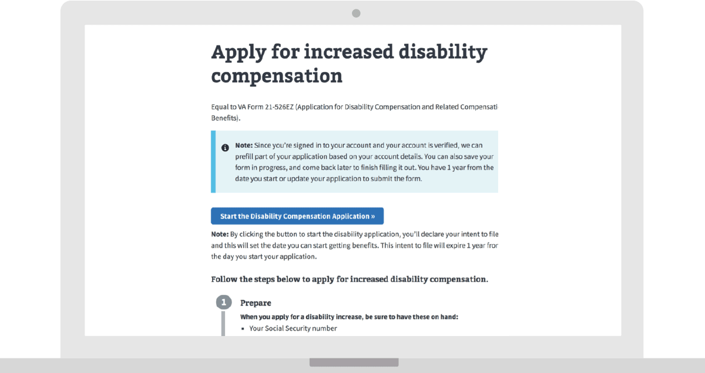

---
# Page template info (DO NOT EDIT)
layout: default
banner_file: banner--people-projects-lg.svg
banner_file_mobile: banner--people-projects-sm.svg
project_page: true

# Carousel (Edit this)
carousel_title: "Disability Compensation Application"
carousel_summary: "Simplifying Veterans' application for disability compensation."
carousel_image_name: project-va-seal-card.gif
hide: true

# Project detail page (Edit this)
title: "Disability Compensation Application"
agency: Veterans Affairs
permalink: projects/disability-compensation-application.html
project_url: https://www.va.gov/disability/how-to-file-claim/

# The Impact (Edit this)
impact_statement:
  - figure: ""
    unit: ""
    description: |-
      Description goes here.
---

## The Challenge

It's confusing and stressful for Veterans to apply for disability compensation, especially without the help of a 3rd party like a Veteran Service Organization (VSO). VA's development and rating process for claims is complex, difficult to understand, and often leaves Veterans feeling anxious and forgotten. The lack of clarity can also lead to mis-ratings, or misunderstanding of ratings, and a snowball of Appeals.

## The Solution

Digital Service at Veterans Affairs created plain language instructions to help Veterans understand if they are eligible for disability compensation, and let them know what evidence and documents they needed to provide to create a strong application. These instructions currently navigate to the existing application on VA’s e-benefits portal, but eventually a new, digital end-to-end claims process will be developed with user-centered, self-service tools. In Fall of 2018 Digital Service released an MVP for the end-to-end claims application process that assists Veterans with applying for a Claim for Increased Disability compensation. This tool, now live and in beta, prepopulates information into the forms and walks Veterans through a simple 5-step process to apply.

<blockquote class="pullquote" markdown="1">
It's very easy to navigate; it's user friendly. I just didn't have a lot of problems with it. It's built well to be easily navigable and it really walks you through the process.
 <footer>– a Veteran during a user research session</footer>
</blockquote>
